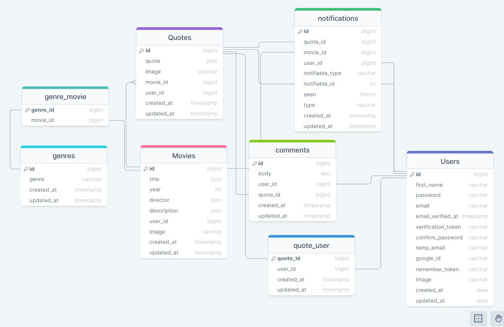

## epic movie quotes API

API for the Epic Movie Quotes App. Protects requests using Laravel Sanctum's SPA Authentication, with built-in cookie based session authentication service.

In addition to handling user registration and login, the API also manages essential features such as email verification and password resetting. Furthermore, it provides convenient Google authorization for simplified authentication.

The API ensures integration between the front-end and the database, enabling the storage of various records such as users, movies, and quotes along with their corresponding Eloquent relationships. It handles all necessary database operations required by the front-end.

For better user experience, real-time notifications are implemented using Laravel's broadcasting feature with Pusher driver. This allows users to receive immediate notifications as they interact with the application.

## Table of Contents

-   <a href="#prerequisites">Prerequisites</a>
-   <a  href="#tech-stack">Tech Stack</a>
-   <a  href="#getting-started">Getting Started</a>
-   <a  href="#migration">Migration</a>
-   <a  href="#development">Development</a>
-   <a  href="#drawsql-diagram">Resources</a>

---

## Prerequisites

-    PHP@8.2.4 and up
-    MYSQL@8.0.32 and up
-    npm@9.5 and up
-    composer@2 and up

---

## Tech Stack

-   
    <a target="_blank" href="https://laravel.com/docs/10.x/installation">
    Laravel@10.x - back-end framework
    </a>

-   
    <a target="_blank" htef="https://redberry.gitbook.io/resources/laravel/php-is-linteri">
    PHP CS Fixer - code formatter
    </a>

-   
    <a target="_blank" htef="https://laravel.com/docs/10.x/sanctum">
    Laravel Sanctum - authentication system for SPA
    </a>

-   
    <a target="_blank" htef="https://pusher.com/">
    Pusher - Hosted WebSockets for interactive apps
    </a>

---

## Getting Started

1. First of all you need to clone repository from github:

```sh
git clone https://github.com/RedberryInternship/lika-gvaramashvili-epic-movie-quotes-back.git
```

2. Next step requires you to run composer install in order to install all the dependencies.

```sh
composer install
```

3. after you have installed all the PHP dependencies, it's time to install all the JS dependencies:

```sh
npm install
```

4. Now we need to set our env file. Go to the root of your project and execute this command.

```sh
cp .env.example .env
```

And now you should provide .env file all the necessary environment variables:

---

MYSQL:

> DB_CONNECTION=mysql

> DB_HOST=127.0.0.1

> DB_PORT=3306

> DB_DATABASE=\*\*\*

> DB_USERNAME=\*\*\*

> DB_PASSWORD=\*\*\*

---

PUSHER:

> BROADCAST_DRIVER=pusher

> PUSHER_APP_ID=\*\*\*

> PUSHER_APP_KEY=\*\*\*

> PUSHER_APP_SECRET=\*\*\*

---

MAILTRAP:

> MAIL_MAILER=smtp

> MAIL_HOST=sandbox.smtp.mailtrap.io

> MAIL_PORT=2525

> MAIL_USERNAME=\*\*\*

> MAIL_PASSWORD=\*\*\*

> MAIL_ENCRYPTION=tls

> MAIL_FROM_ADDRESS=\*\*\*

> MAIL_FROM_NAME=\*\*\*

---

to generate APP_KEY you can run:

```sh
php artisan key:generate
```

---

after setting up .env file, execute:

```sh
php artisan config:cache
```

in order to cache environment variables.

Now, you should be good to go!

---

## Migration

if you've completed getting started section, then migrating database is fairly simple process, just execute:

```sh
php artisan migrate
```

---

## Development

You can run Laravel's built-in development server by executing:

```sh
php artisan serve
```

---

## Drawsql Diagram


